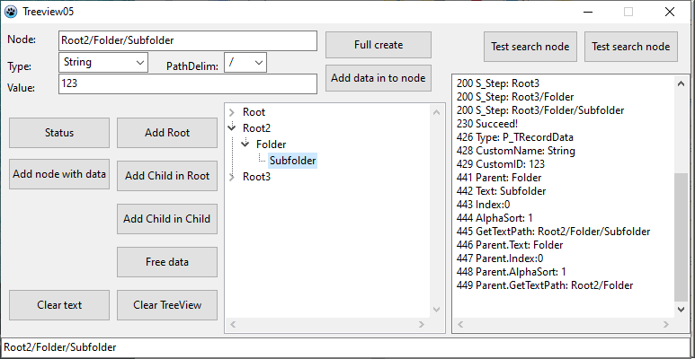

# Tree_View_Sample
Tree view sample 

* node *
procedure TForm1.OnIdle no need to run fast loop (Done = default true)

Related repositories
  - https://github.com/DavidTh30/LogMessageUsingConsole20Line
  - https://github.com/DavidTh30/HeapStatusConsole5
